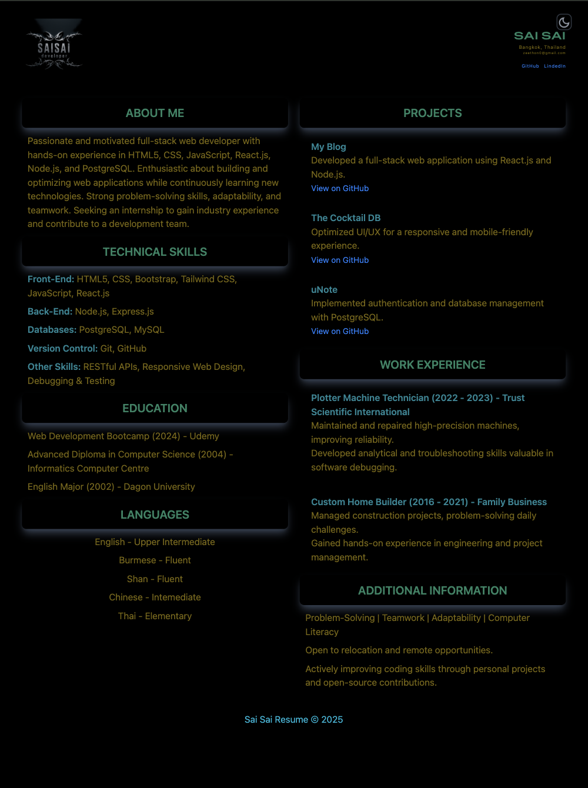
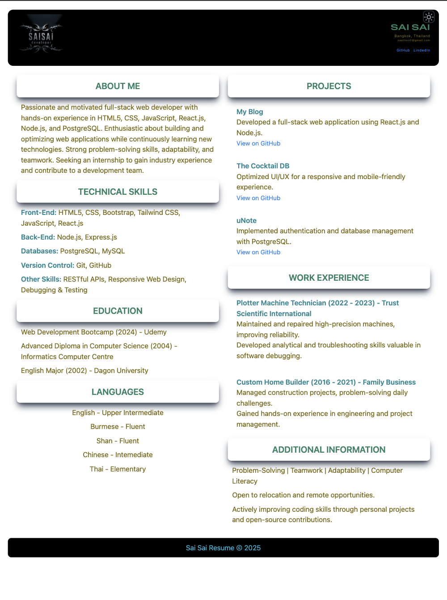
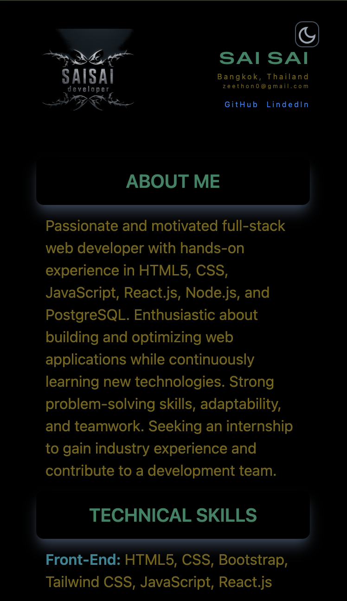
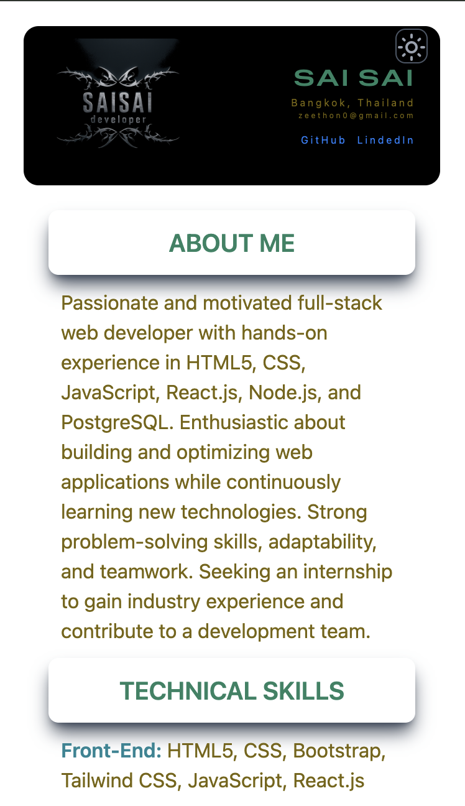

### My Resume Portfolio

A responsive personal portfolio built with React. This site showcases my resume, projects, and contact information in a clean and professional layout.


## 🚀 Live Demo

[View Portfolio](https://zeethonse.github.io/my-resume-app/)

## 📸 Screenshots







## 🔧 Tech Stack

- React.js
- HTML5 & CSS3
- JavaScript
- Bootstrap (or Tailwind, if used)
- Vercel (Deployment)


## ✨ Features

- Responsive design
- Smooth scrolling and navigation
- Project highlights section
- Resume download (if available)
- Contact form or social media links


git clone https://github.com/zeethonSE/my-resume-app.git
cd my-resume-app
npm install
npm run dev

## 📂 Project Structure

This is a React-based single-page application featuring:

About section

Skills display

Project showcase with GitHub links

Education & experience

Fully responsive layout with modern styling


## 🛠️ Built With

React (Vite)

Tailwind CSS (or your CSS framework)

GitHub Pages (for deployment)

Custom components


## 🛠 How to Run Locally

git clone https://github.com/zeethonSE/my-resume-app.git

```bash
cd my-resume-app
npm install
npm run dev
```

Then visit: http://localhost:5173/my-resume-app/


## 🚀 Deployment

The app is deployed via GitHub Pages using the gh-pages branch. To deploy manually:

npm run build
npm run deploy

Ensure your vite.config.js has the correct base set:
base: '/my-resume-app/'


## 🙋‍♂️ Author

Sai Sai
💼 Web Developer
📧 zeethon0@gmail.com
🔗 [LinkedIn](https://linkedin.com/in/ssaiwd25)


📄 License
This project is open source and available under the [MIT License.](MIT-LICENSE)